# Deep Fluids: A Generative Network for Parameterized Fluid Simulations

Tensorflow implementation of [Deep Fluids: A Generative Network for Parameterized Fluid Simulations](http://www.byungsoo.me/project/deep-fluids).

[Byungsoo Kim](http://www.byungsoo.me)¹, [Vinicius C. Azevedo](http://graphics.ethz.ch/~vviniciu/)¹, [Nils Thuerey](https://ge.in.tum.de/)², [Theodore Kim](http://www.tkim.graphics/)³, [Markus Gross](https://graphics.ethz.ch/people/grossm)¹, [Barbara Solenthaler](https://graphics.ethz.ch/~sobarbar/)¹

¹ETH Zurich, ²Technical University of Munich, ³Pixar Animation Studios

Computer Graphics Forum (Proceedings of Eurographics 2019)

## Requirements

This code is tested on Windows 10 and Ubuntu 16.04 with the following requirements:

<!-- - [anaconda / python3.6](https://www.anaconda.com/download/) (run `conda install python=3.6` for the latest version.) -->
- [TensorFlow 1.12](https://www.tensorflow.org/install/)
- [mantaflow](http://mantaflow.com)

Run the following line to install packages.

    $ pip install --upgrade tensorflow-gpu tqdm matplotlib Pillow imageio

To install `mantaflow`, run:

    $ git clone https://bitbucket.org/mantaflow/manta.git
    $ git checkout 15eaf4
    
and follow the [instruction](http://mantaflow.com/install.html). Note that `numpy` cmake option should be set to enable support for numpy arrays. (i.e., `-DNUMPY='ON'`)

## Usage

Run a script for the dataset generation using mantaflow. For instance,

    $ ..\manta\build\Release\manta.exe .\scene\smoke_pos_size.py

To train:
    
    $ python main.py

To test:
    
    $ python main.py --is_train=False --load_path=MODEL_DIR

Please take a closer look at `run.bat` for each dataset and other architectures.

### Extra instructions for ElectroMagnetic Navigation System Modeling
The cmag dataset contained in master_feature_matrix_v5.npy first needs to be upsampled to a 16x16x16 grid before being
used as a dataset in deep-fluids. The preprocess_cmag.py script handles that. This script also splits the data between
the training set and test set by saving a shuffling a subset of the current indices and saving those for reuse.

Generating the test data is performed using the tester.py script. It requires a path to the model that you would like to
test. Also make sure to specify if you are using the divergence-free or regular CNN.

    python tester.py --load_model_dir log/cmag_dataset/0304_142438_de_123/

This will generate the test data using the latest model in log/cmag_dataset/0304_142438_de_123

    python tester.py --load_model_dir log/cmag_dataset/0304_142438_de_123/ --use_curl True

This will generate the test data using the latest model in log/cmag_dataset/0304_142438_de_123 assuming that the model
is a divergence-free one.

The tester script outputs are file with the model.cpkt.test_stats that contains the following information.
R2_x R2_y R2_z
RMSE_x RMSE_y RMSE_y
MAE_x MAE_y MAE_z
N-MAE_x N-MAE_y N-MAE_z

Where R2_x is the coefficient of determination of the x axis 
RMSE_x is the mean root mean square error of the x axis
MAE_x is the mean absolute error of the x axis
N-MAE_x is the normalized mean absolute error of the x axis

In order to perform the comparative analysis with the other methods, you need to make the tester script output the
prediction values. Set self.save_output to True in tester.py. This will save the predicted magnetic field values in the 
test to the path in the save_data_path config variable. 

## Result (2D)

### Reconstruction from each parameter after 100 epochs (From top to bottom: position / width / time)

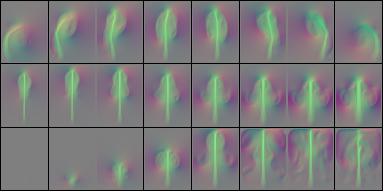

### Reconstruction of random samples after 100 epochs (Top: reconstructed, bottom: ground truth)

In each image, the top row shows velocity profiles, and the bottom row shows vorticity profiles.

## Result (3D)

### Reconstruction from each parameter after 100 epochs. (From top to bottom: in-flow velocity / buoyancy / time)

The left image shows the middle slice of xy domain, and the right image is the middle slice view of zy domain.

In each image, the top three rows are velocity profiles, and the rest rows are vorticity profiles.

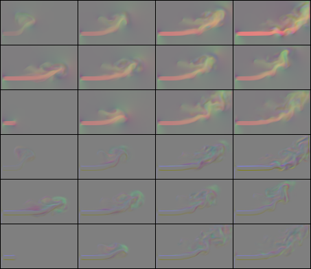 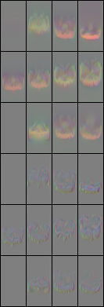

### Reconstruction of random samples after 100 epochs (Top: reconstructed (xy-zy), bottom: ground truth (xy-zy))

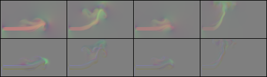 

 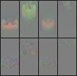

## Result (Autoencoder)

### Reconstruction (2D) of random samples after 10 epochs (Top: reconstructed, bottom: ground truth)

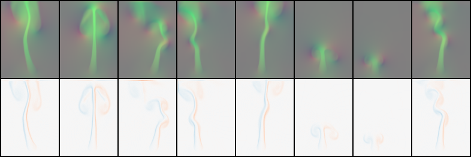

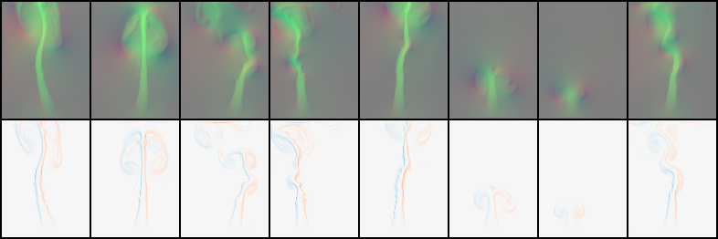

### Reconstruction (3D) of random samples after 10 epochs (Top: reconstructed (xy-zy), bottom: ground truth (xy-zy))

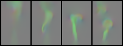 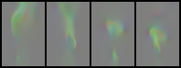

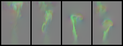 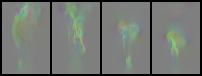

## Authors

[Byungsoo Kim](http://www.byungsoo.me) / [@byungsook](https://github.com/byungsook)

Samuel Charreyron / samuelch@ethz.ch
