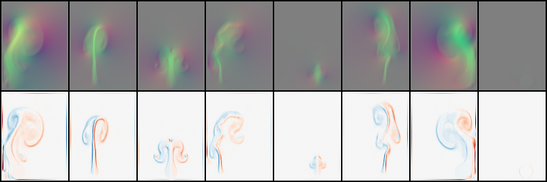

# Deep Fluids: A Generative Network for Parameterized Fluid Simulations

Tensorflow implementation of [Deep Fluids: A Generative Network for Parameterized Fluid Simulations](http://www.byungsoo.me/project/deep-fluids).

[Byungsoo Kim¹](http://www.byungsoo.me), [Vinicius C. Azevedo¹](http://graphics.ethz.ch/~vviniciu/), [Nils Thuerey²](https://ge.in.tum.de/), [Theodore Kim³](http://www.tkim.graphics/), [Markus Gross¹](https://graphics.ethz.ch/people/grossm), [Barbara Solenthaler¹](https://graphics.ethz.ch/~sobarbar/)

¹ETH Zurich, ²Technical University of Munich, ³Pixar Animation Studios

Computer Graphics Forum (Proceedings of Eurographics 2019)

## Requirements

This code is tested on Windows 10 and Ubuntu 16.04 with the following requirements:

- [anaconda / python3.6](https://www.anaconda.com/download/)
- [TensorFlow 1.12](https://www.tensorflow.org/install/)
- [tqdm](https://github.com/tqdm/tqdm)
- [mantaflow](http://mantaflow.com/)

After installing anaconda, run `pip install --ignore-installed --upgrade tensorflow-gpu tqdm`. To install `mantaflow`, please follow the instruction at [mantaflow website](http://mantaflow.com).

## Usage

Run a script for dataset generation using mantaflow below. For instance,

    $ ..\manta\build\Release\manta.exe ./smoke_pos_size.py

To train:
    
    $ python main.py

To test:
    
    $ python main.py --is_train=False --load_path=MODEL_DIR

## Results

### Output for each parameter after 100 epochs (From top to bottom: position / width / time)

### Output of random samples after 100 epochs (Top: reconstructed, bottom: ground truth)

